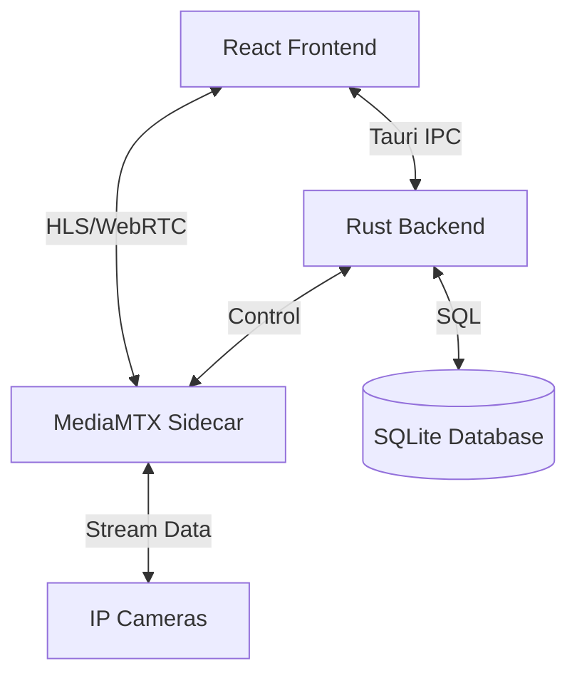

# System Architecture

Surveil uses a hybrid architecture that separates the User Interface (Frontend), Business Logic (Backend), and Media Processing (Media Sidecar).

## 🏗️ General Overview
The application runs as a native desktop application via Tauri. Tauri acts as a bridge between the WebView (Frontend) and the Rust process (Backend).

## 🧩 Architectural Components

### 1. Tauri Bridge (IPC)
Communication between the Frontend and Backend is conducted via *Commands* and *Events*. 
- **Commands:** Used when the UI requests data (e.g., `get_cameras`) or commands an action (e.g., `add_camera`).
- **Events:** Used when the Backend needs to send notifications to the UI asynchronously (e.g., camera connection status changes).

### 2. MediaMTX Sidecar
Surveil does not process raw video directly within Rust/React. Instead, the application launches **MediaMTX** as a background process (*Sidecar*).
- Rust is responsible for starting, monitoring, and stopping MediaMTX.
- MediaMTX handles heavy protocols like RTSP from cameras and provides them back to the UI in browser-friendly formats (such as HLS or WebRTC).

### 3. Data Persistence
Data is stored locally in the `surveil.sqlite3` file.
- **Location:** The database file is typically located in the application data folder (following OS standards).
- **Schema:** The database stores camera metadata (IP, name, credentials) and application settings.

### 4. Bootstrap Lifecycle
When the application is launched:
1. Rust initializes logging and the database.
2. Rust checks for the existence of the MediaMTX binary and executes it.
3. The main Tauri window (React) is displayed.
4. React performs its first *invoke* command to fetch the camera list from SQLite.
